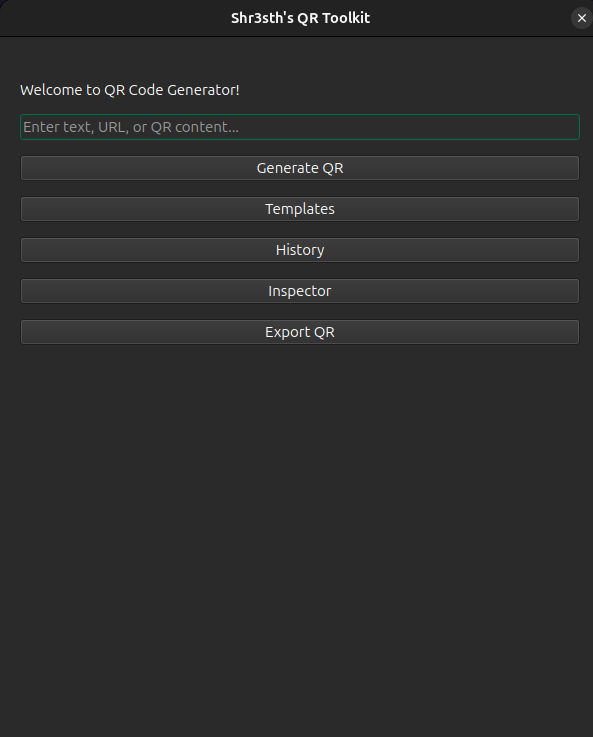
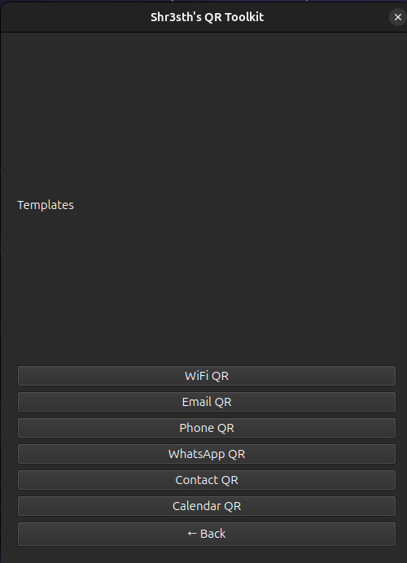
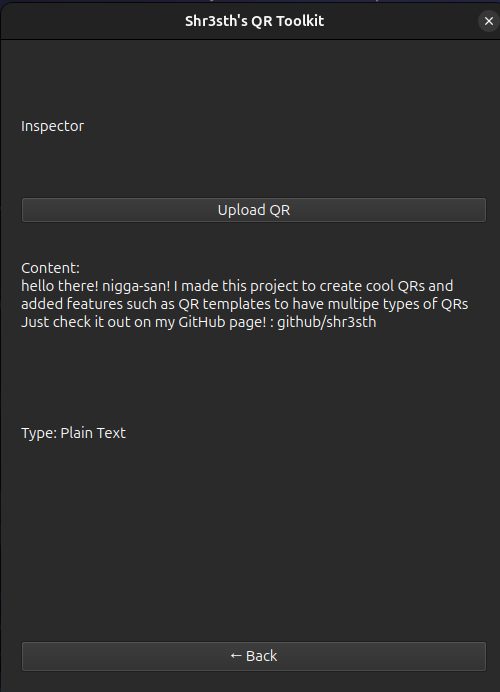
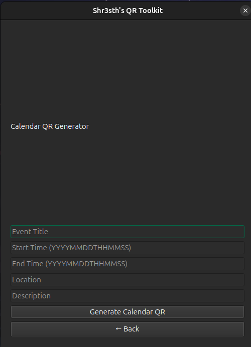

# QR Toolkit

A desktop QR Toolkit built with Python and PyQt6.

This application can generate, inspect, decode, and analyze QR codes while also providing useful QR templates for common real-world use cases.

---

## Features

### QR Generation

- Generate QR codes from any text or URL
- Instant QR preview inside the application
- Export generated QR codes as PNG images

### QR History

- Automatically saves generated QR codes
- Stores generation history in JSON format
- View previously generated QR content
- Clear history when needed

### QR Inspector

- Upload and decode existing QR codes
- Display decoded content
- Detect QR code type automatically
- Basic URL safety analysis using a local blocklist

### QR Type Detection

Detects:

- URL
- WiFi Network
- Email
- Phone Number
- WhatsApp Link
- Contact Card (vCard)
- Calendar Event
- Plain Text

### QR Templates

Generate specialized QR codes for:

- WiFi Networks
- Email Templates
- Phone Numbers
- WhatsApp Messages
- Contact Cards (vCard)
- Calendar Events

---

## Screenshots

### Main Generator



### Templates



### Inspector



### Calendar Template



## Technologies Used

- Python 3
- PyQt6
- qrcode
- Pillow
- pyzbar
- JSON

---

## Project Structure

```
SH_QR_CODE_GEN/
│
├── data/
│   ├── history.json
│   └── blocked_domains.json
│
├── output/
│   └── qr.png
│
├── src/
│   ├── gui.py
│   ├── qr_generator.py
│   ├── qr_decoder.py
│   ├── qr_analyzer.py
│   ├── qr_templates.py
│   ├── safety_checker.py
│   └── history_manager.py
│
├── requirements.txt
└── README.md
```

---

## Installation

Clone the repository:

```bash
git clone https://github.com/shr3sth/ultimate_qr_toolkit.git
cd ultimate_qr_toolkit
```

Create a virtual environment:

```bash
python3 -m venv venv
source venv/bin/activate
```
Install dependencies:

```bash
pip install -r requirements.txt
```

Run the application:

```bash
python3 src/gui.py
```

---

## Security Disclaimer

The URL safety checker uses a local demonstration blocklist.

It is intended for educational purposes and basic phishing-awareness demonstrations only.

A production-grade implementation would use continuously updated threat intelligence feeds.

---

## Future Improvements

- Dark/light theme support
- Custom QR colors
- Custom QR sizing
- Live phishing feed integration
- Searchable history
- Improved QR reputation analysis

---

## Author

Shresth Dehuliya
